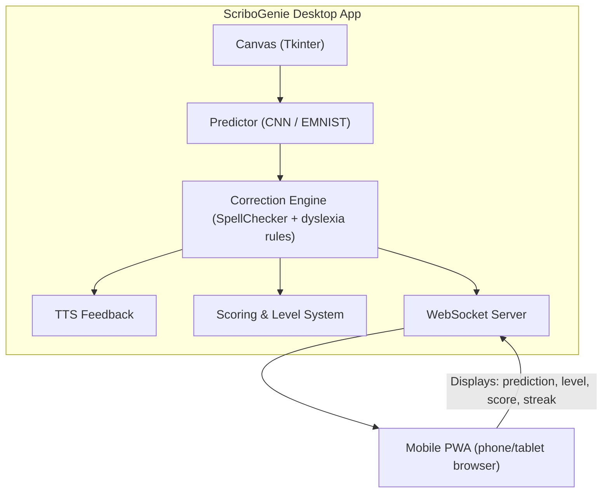

# ScriboGenie — Handwriting Recognition & Dyslexia Assistance System

ScriboGenie is an intelligent handwriting recognition system designed to help learners with writing difficulties such as Dyslexia and Dysgraphia. It uses a CNN model trained on EMNIST to recognize handwritten characters in real time, with dyslexia-aware correction, multi-sensory feedback, and a companion mobile PWA.

> **Cross-platform**: Runs on Windows (mouse/TTS) and Raspberry Pi (Wacom/espeak).

---

## Features

- **Real-time character recognition** — Event-driven CNN prediction on pen-up (zero idle CPU)
- **Dyslexia-aware correction** — Handles common letter confusions (b/d, p/q, i/l, etc.)
- **Lesson system** — Progressive word bank with auto level-up on 3-streak
- **Character-level feedback** — TTS tells you which character was wrong and what it should be
- **Stroke management** — Undo/redo with per-stroke groups
- **Companion mobile PWA** — View predictions, level, score, and streak on phone
- **Offline** — No internet required after setup

---

## Architecture



---

## Getting Started (Windows)

### Prerequisites

- Python 3.9+
- Git LFS (for the model file)

```bash
# Install Git LFS
git lfs install
```

### Setup

```bash
# Clone
git clone https://github.com/sujith0613/ScriboGenie.git
cd scribo

# Pull model via LFS
git lfs pull

# Optional: create virtual environment
python -m venv venv
venv\Scripts\activate

# Install dependencies
pip install -r requirements.txt
```

### Run

```bash
python app.py
```

Draw on the canvas. Recognized text appears in the side panel. Automatic correction, scoring, and level progression are built in.

### Mobile Companion

1. Run the desktop app (starts a WebSocket server on port 8765 + HTTP server on port 8000)
2. Connect your phone to the same network
3. Open `http://<computer-ip>:8000` in your phone browser
4. See predictions, level, score, streak in real time

---

## Project Structure

```
ScriboGenie/
├── app.py                 # Main application (cross-platform)
├── recognizer_pi.py       # Standalone recognition utilities
├── utils_pi.py            # Standalone image processing utilities
├── models/
│   └── myCnn.h5           # Trained CNN model (via Git LFS)
├── mobile/
│   ├── index.html         # Companion PWA
│   └── manifest.json
├── requirements.txt       # Python dependencies
├── problems_and_fixes.md  # Bug tracking & changelog
├── .gitattributes         # LFS config
└── README.md
```

---

## License

All Rights Reserved. See [LICENSE](LICENSE).

---

## Acknowledgments

- EMNIST dataset for handwritten character recognition
- TensorFlow / Keras for model training & inference
